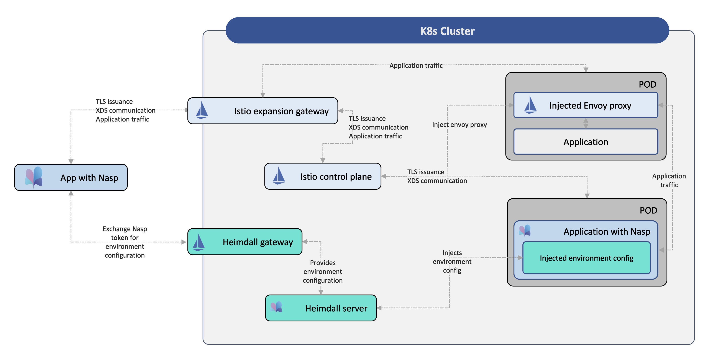

## Nasp

**THIS REPO IS CURRENTLY IN PREVIEW. THE APIS ARE NOT FINAL AND ARE SUBJECT TO CHANGE WITHOUT NOTICE.**

Nasp is an **open-source, lightweight library** to expand service mesh capabilities to non-cloud environments by getting rid of the complexity of operating dedicated network proxies. It is not meant to be a complete service mesh replacement, but rather an extension. It integrates well with an Istio control plane, so applications using Nasp can be handled as standard Istio workloads.

Nasp offers the most common functionality of a sidecar proxy, so it eases the developer burden for traffic management, observability, and security. Its range of capabilities includes:

- Identity, and network traffic security using mutual TLS
- Automatic traffic management features, like HTTP, or gRPC load balancing
- Transparent observability of network traffic, especially standard Istio metrics
- Dynamic configuration through xDS support

To learn more about why we created Nasp, and where it could help, read our introduction [blog](https://techblog.cisco.com/blog/nasp-intro).

## Architecture

Nasp is primarily a library that can be included in application code to provide service mesh functionality without operating proxies.
But Nasp is also hybrid model in the sense that it still communicates with a central Istio control plane, and configuration is still declarative and centrally managed. The service dicovery, certificate management and configuration logic isn't handed out to the applications like in a pure library model. These remain the same as with standard Istio - though somewhat limited in functionality.

Therefore Nasp has a minimal component running in a Kubernetes cluster next to an existing Istio control plane. This component is called [Heimdall](./components/heimdall/), and it is the main entry point for a Nasp-enabled application to an existing service mesh. Heimdall automatically injects Istio configuration - like workload metadata, network and mesh settings, or where to receive certificates from - in applications that use Nasp.

Nasp workloads can run in- or outside of the service mesh, or even the Kubernetes cluster.



## Quick start

The quick start will guide you through a common Nasp setup, where an external, Nasp-enabled application is connected to an Istio service mesh running in a Kubernetes cluster. At the end of the example you'll see how a Golang application running on your local machine can send HTTP requests to internal Kubernetes workloads through standard Istio service discovery, using mTLS, but without running an Envoy proxy next to it.

### Prerequisites

First, we'll need to setup the Kubernetes environment with Istio and the necessary Nasp components.
To make it easier, we wrote a script that creates a local [`kind`](https://github.com/kubernetes-sigs/kind) cluster and installs all the reqirements.

To get started, simply run the [`deploy-kind.sh`](test/deploy-kind.sh) script in the `test` directory:

```
./test/deploy-kind.sh
```

Once the script finished check if everything is up and running: 

1. A standard Istio installation with a control plane and a mesh expansion gateway. By default, Istio is managed by our [istio-operator](https://github.com/banzaicloud/istio-operator/), but upstream Istio installations can also be used with Nasp. 


```
> k get pods -n istio-system
NAME                                             READY   STATUS    RESTARTS   AGE
istio-meshexpansion-icp-v115x-7c68bddf4c-zlphw   1/1     Running   0          69m
istio-operator-74c544fd8c-vr98s                  2/2     Running   0          73m
istiod-icp-v115x-7577bf56d-q4r4s                 1/1     Running   0          69m
```

2. A [Heimdall](./components/heimdall/) deployment and a Heimdall gatweway. Heimdall is the main entry point for a Nasp-enabled application to an existing service mesh. Heimdall eliminates the need for developers to manually configure Istio settings for applications that use Nasp by authenticating clients and automatically injecting configuration. Read more about Heimdall in its [documentation](./components/heimdall/).

```
> k get pods -n heimdall
NAME                          READY   STATUS    RESTARTS      AGE
heimdall-f97745497-jvzws      3/3     Running   2 (69m ago)   69m
heimdall-gw-74c79d5c8-6r6qp   1/1     Running   0             69m
```

3. An `echo` service that's running with an Istio sidecar proxy. It is a test deployment in our Kubernetes cluster that we'll send HTTP requests to from an external Nasp-enabled client.

```
> k get pods -n testing
NAME                    READY   STATUS    RESTARTS   AGE
echo-5d44b7fbd5-ldrcj   3/3     Running   0          77m
```

### Testing

Now that we have our Kubernetes environment ready, we'll start a Golang client on our local machine and we'll send some HTTP requests to the `echo` service in Kubernetes.
To do that, simply go into the `examples/http` folder and run the following `make` command:

```
make CLIENT_REQUEST_URL="http://echo.testing"  run-client
```

You should see some logs containing the (empty) response and some interesting headers. They show that the request URI was the same service address that you would use inside the cluster, and that our client has sent a client certificate that was accepted by the Istio proxy inside the cluster:

```
Hostname: echo-5d44b7fbd5-ldrcj

Pod Information:
	-no pod information available-

Server values:
	server_version=nginx: 1.20.2 - lua: 10020

Request Information:
	client_address=127.0.0.6
	method=GET
	real path=/
	query=
	request_version=1.1
	request_scheme=http
	request_uri=http://echo.testing:8080/

Request Headers:
	accept-encoding=gzip
	host=echo.testing
	user-agent=Go-http-client/1.1
	x-b3-sampled=0
	x-b3-spanid=d13c98a43a1705fb
	x-b3-traceid=92f47b07527a04bed13c98a43a1705fb
	x-forwarded-client-cert=By=spiffe://cluster.local/ns/testing/sa/default;Hash=df95762fffe354c4ba1e4e70130c8d9e3209f0f9946ef0ef9b28e66f05c11cc0;Subject=&quot;&quot;;URI=spiffe://cluster.local/ns/external/sa/test-http
	x-forwarded-proto=https
	x-request-id=ae071df5-e2f4-4ba0-a200-9e72b9827db5

Request Body:
	-no body in request-
```

### Explanation

Let's see what's inside our Makefile and our Golang code to understand what happened above.

1. Makefile

The Makefile is very simple: it calls our Golang application with `go run` and passes it the `CLIENT_REQUEST_URL` we've specified above.
The only interesting part is that it gets a Nasp authentication token from a Kubernetes secret and passes it to our application:

```
NASP_AUTH_TOKEN ?= $(shell kubectl -n external get secret -l nasp.k8s.cisco.com/workloadgroup=test-http -o jsonpath='{@.items[0].data.token}' | base64 -d)
```

The secret is used by the Nasp library to get the necessary Istio configuration (what network, cluster or mesh to join, or where to get the required certificates from) for the application from Heimdall. 
But where is this secret coming from? If you take a look at the end of our init [script](./test/deploy-kind.sh), you'll see that we've created a few `WorkloadGroup` resources.
These are standard [Istio resources](https://istio.io/latest/docs/reference/config/networking/workload-group/) used to describe a set of non-k8s workloads.
[Heimdall](./components/heimdall/) watches these resources and creates corresponding access tokens in Kubernetes secrets for the related external workloads.

For our example, Heimdall needs to be accessible from outside of the cluster. Usually that is achieved through a Heimdall gateway, whose address is configurable through Nasp. We haven't specified the address in the Makefile because we're using the default value to reach it.

2. Golang code

Now let's see what we did in our Golang code to make the HTTP requests we're sending go through Nasp.

First we import the library:

```go
import (
  "github.com/cisco-open/nasp/pkg/istio"
  "github.com/cisco-open/nasp/pkg/network"
)
```

Then we create and start an `IstioIntegrationHandler`:

```go
istioHandlerConfig := &istio.IstioIntegrationHandlerConfig{
    UseTLS:              true,
	IstioCAConfigGetter: istio.IstioCAConfigGetterHeimdall(ctx, heimdallURL, authToken, "v1"),
}

iih, err := istio.NewIstioIntegrationHandler(istioHandlerConfig, logger)
if err != nil {
	panic(err)
}

if err := iih.Run(ctx); err != nil {
    panic(err)
}
```

And finally, we send the HTTP request through the Nasp transport layer we get from the `IstioIntegrationHandler`:

```go
transport, err := iih.GetHTTPTransport(http.DefaultTransport)
if err != nil {
    panic(err)
}

httpClient := &http.Client{
    Transport: transport,
}

request, err := http.NewRequest("GET", url, nil)
if err != nil {
    return err
}

response, err := httpClient.Do(request)
if err != nil {
    return err
}
```  

## Other examples

In the [`examples`](./examples) directory we have similar examples on how to use Nasp with HTTP, gRPC, or TCP connections from Golang.
All examples can be run either as servers or clients. Refer to the `Makefiles` on how to run these examples, and check out the Golang code to learn how to use Nasp for specific protocols. 

## Support for other languages

The core code of Nasp is written in Golang, that's why the main examples are also written in Go.
But Nasp could also be imported from other languages with the help of C bindings generated from the core codebase.
A thin shim layer still has to be written for specific platforms, but the core functionality is unchanged.

Currently supported languages are:

- [Java frameworks](./experimental/java): Spring and Nio
- [Mobile platforms](./experimental/mobile): iOS and Android
- [Python](./experimental/python/)

## Issues and contributions

We use GitHub to track issues and accept contributions. If you'd like to raise an issue or open a pull request with changes, refer to our [contribution guide](./CONTRIBUTING.md).